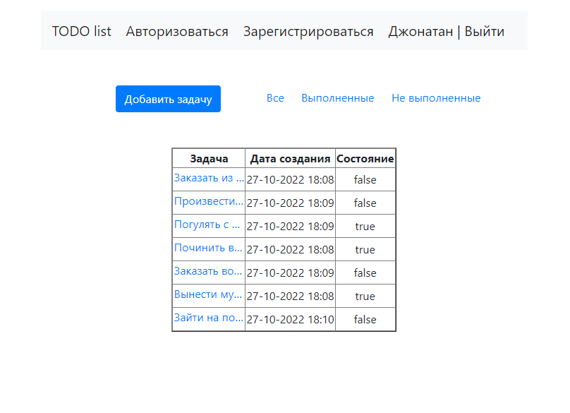
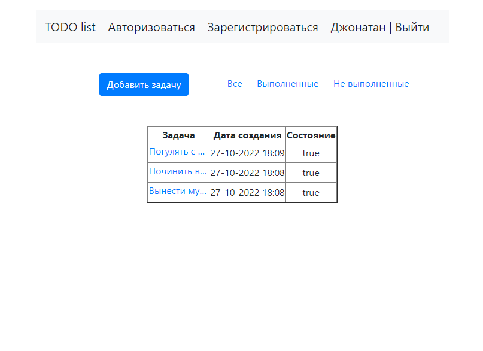
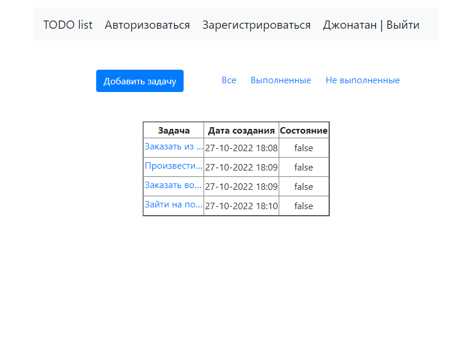
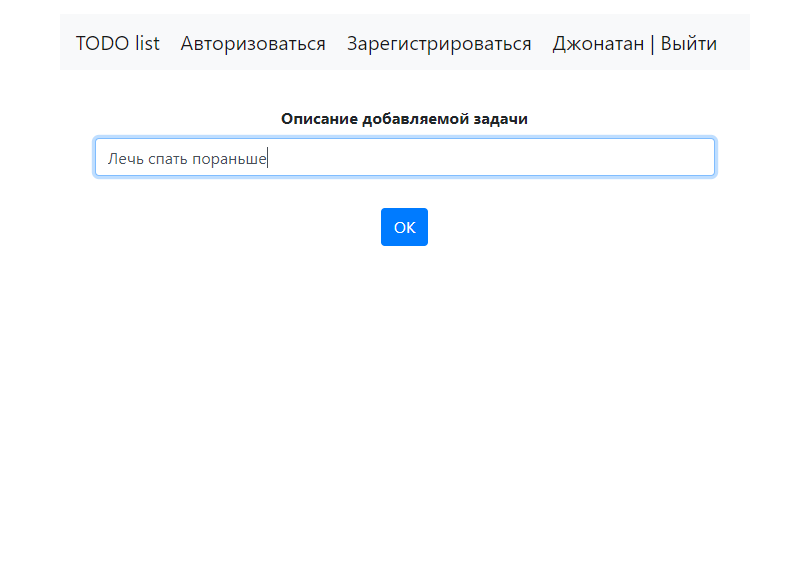
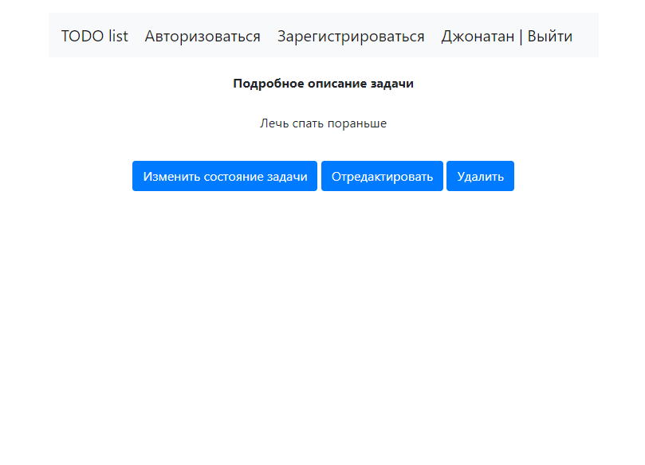
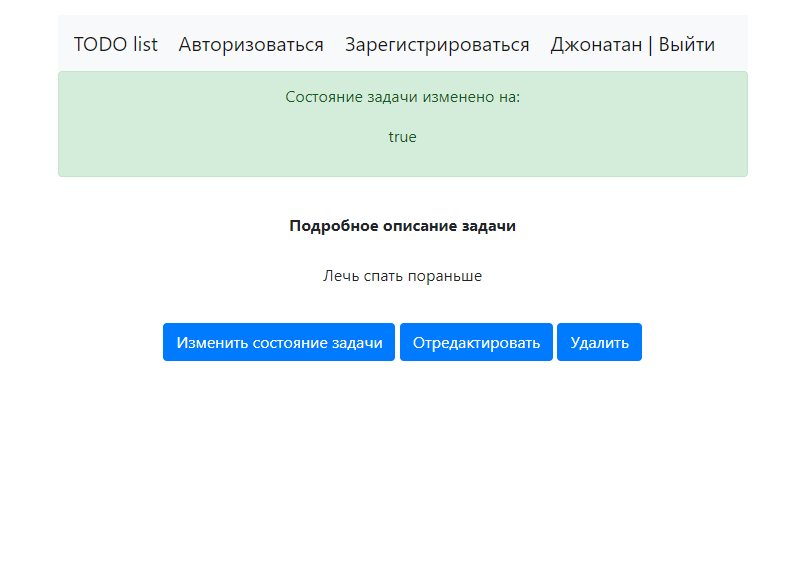
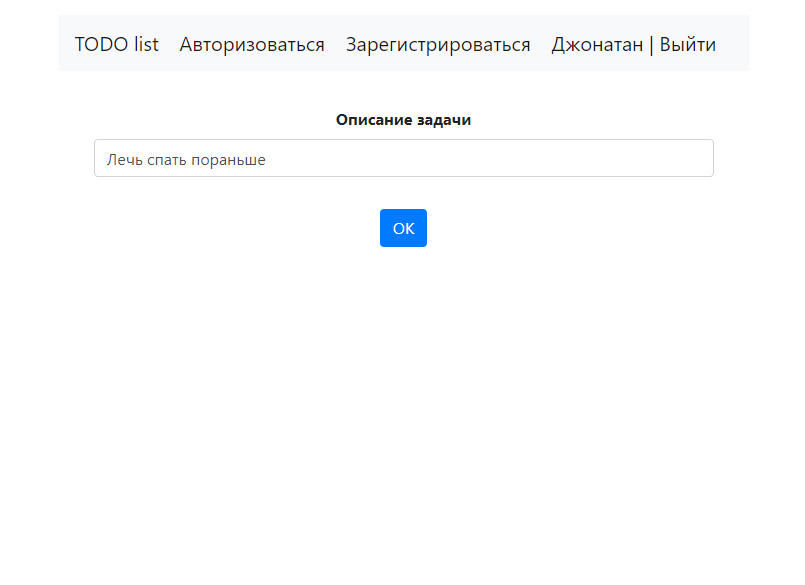
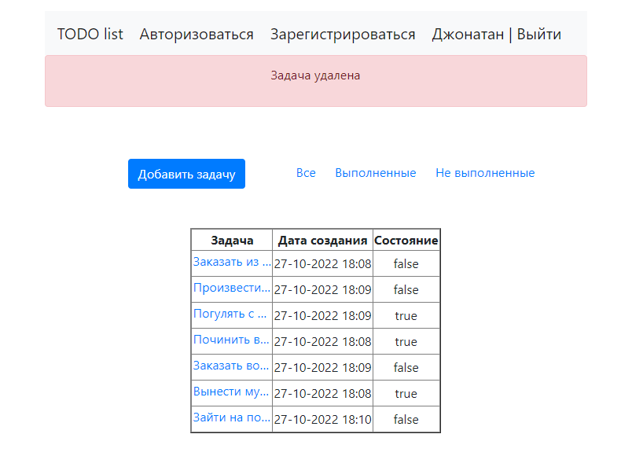

# Проект TODO list

## Описание приложения

Приложение TODO list представляет собой редактируемый список задач.

Пользователю приложения предоставляется возможность:

1. Ознакомиться со списком всех задач;
2. Ознакомиться со списком выполненных задач;
3. Ознакомиться со списком не выполненных задач;
4. Добавлять задачи;
5. Редактировать задачи;
6. Изменять статус задач;
7. Удалять задачи.

## Используемый стек технологий

1. Java 17
2. Spring boot 2.5.2
3. Thymeleaf
4. Hibernate 5.7.11
5. Lombok 1.18.22
6. Liquibase 4.15.0
7. PostgreSQL 14

## Для запуска проекта понадобятся

1. JDK 17
2. Apache Maven 3.8.5
3. PostgreSQL 14
4. Web browser

## Интерфейс сайта

### Главная страница (все задачи)

### Выполненные задачи

### Не выполненные задачи

### Добавить задачу

### Подробное описание задачи

### Изменение состояние задачи

### Редактирование задачи

### Удаление задачи

